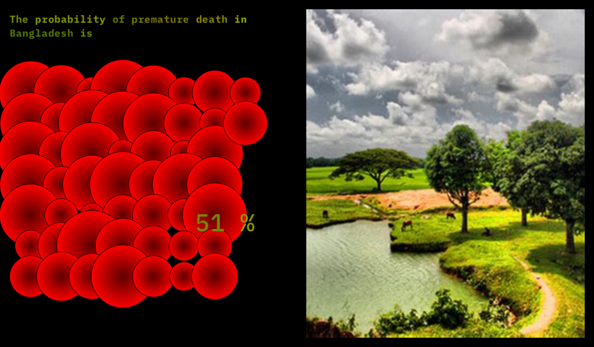
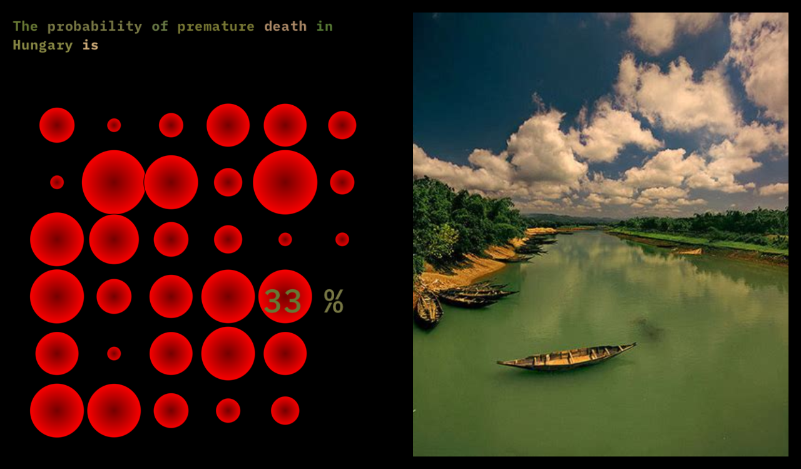

# posters-workshop

## Examples

## Image analysis

## TODO

- [x] change input text
- [x] highlight text based on the most dominant colors in the image
- [ ] change images while changing input text
